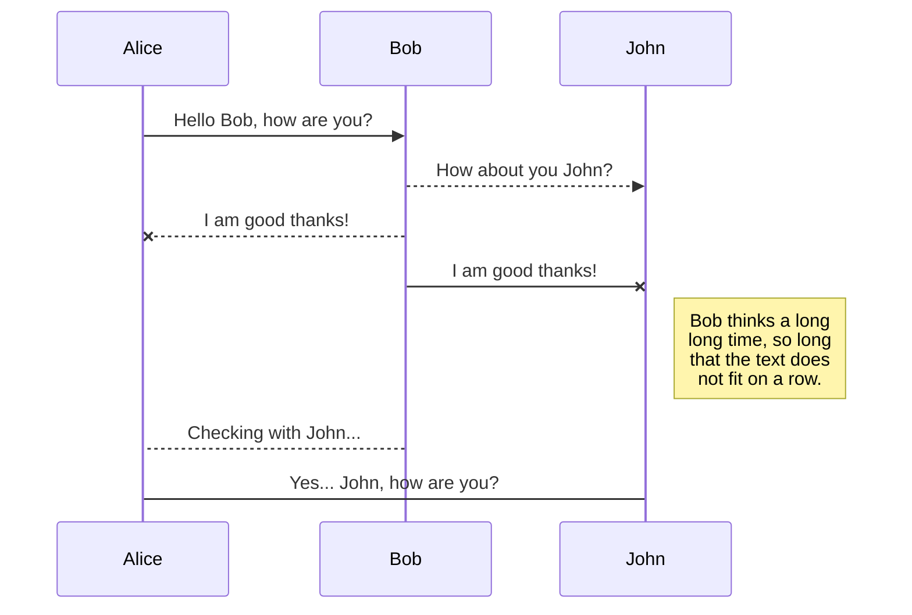

# Example_Webpage
# start the app
Flask_APP=app.py flask run
# run the tests
coverage run --source=. test.py

coverage report  

# run the container
docker run -d -p 80:80 junglepolice/webpage

# This is a title

**paragraph 1**

[paragraph 2](https://www.google.com)

[*paragraph 3*](https://www.linkedin.com)

*[paragraph 4](https://www.bing.com)*

$$
\Gamma(z) = \int_0^\infty t^{z-1}e^{-t}dt\,.
$$

